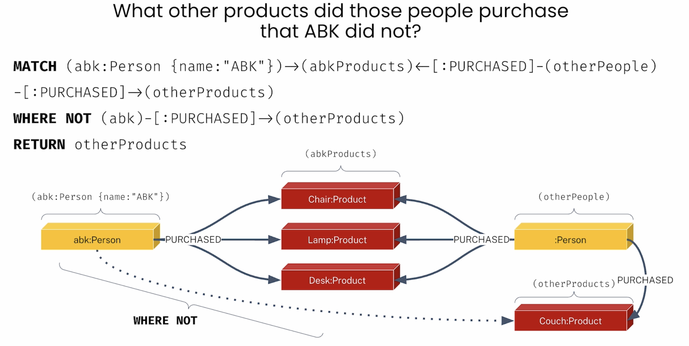

* what is a knowledge graph 
* sample query to a kowledge grap (kg) 
* domain lexical graph model 
* a definition of an AI agent 
* a multi-agent sys overview 
* adk (agent development kit) from google 

# example of a root-cause analysis with kg
You’re a furniture manufacturer looking to understand customer complaints about your products.
Root-cause analysis might include questions like:
*   Which products have the most issues?
*   Is there a problem with the part itself?

**Root-cause analysis: data engineering questions**
*   What is the goal of the analysis?
    1.  understanding possible manufacturing problems in the supply chain
*   What is available?
    1. bill-of-materials (BOM) files from supplier
    2. user review of products, scraped from a website
*   How can the data be analyzed?
    1. build a knowledge graph connecting all day
    2. query using an agent?

* root cause analysis target model 
* multi agent setup for the root cause analysis 
**Agents descriptions**
* knowledge graph agent: top level conversational, overall interaction, guides through major phases
* structured/ unstructured/ graphRAG agents: 
* user intent/ file/ schema/ graph construction agents 
* entity and fact type agent 
* kg construction tool 
* 